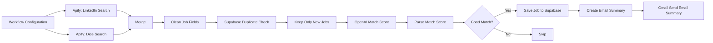

# AI Job Search Agent

An automated job-discovery and matching workflow built with n8n. It gathers roles from LinkedIn and Dice through Apify, normalizes and deduplicates the results, scores each role with OpenAI, saves qualified matches to Supabase, and sends a Gmail summary.

The workflow has been executed successfully end to end.

## What it does

1. Loads search criteria and workflow settings from **Workflow Configuration**.
2. Runs Apify-based searches for **LinkedIn** and **Dice** jobs.
3. Combines both result streams with **Merge**.
4. Standardizes the source data in **Clean Job Fields**.
5. checks Supabase for jobs already processed in **Supabase Duplicate Check**.
6. Removes previously seen records in **Keep Only New Jobs**.
7. Uses **OpenAI Match Score** to evaluate fit against the configured job-search profile.
8. Converts the model response into structured data in **Parse Match Score**.
9. Applies the **Good Match?** threshold.
10. Persists accepted roles with **Save Job to Supabase**.
11. Builds a digest in **Create Email Summary**.
12. Delivers the digest through **Gmail Send Email Summary**.

## Architecture

See [docs/ARCHITECTURE.md](docs/ARCHITECTURE.md) for node responsibilities and data flow.

## Technology

- **n8n** — orchestration and workflow scheduling
- **Apify** — LinkedIn and Dice job-search actors
- **Supabase** — persistence and duplicate detection
- **OpenAI** — job-to-profile match scoring
- **Gmail** — email digest delivery

## Getting started

1. Create the required accounts and credentials described in [docs/SETUP.md](docs/SETUP.md).
2. Copy `.env.example` to `.env` for local reference and supply your own values. Never commit `.env`.
3. Export the n8n workflow with credentials excluded and place it in `workflows/`.
4. Import the workflow into n8n, reconnect credentials, configure search criteria and scoring thresholds, then run a manual test.

> The exported production workflow is intentionally not included yet. `workflows/` contains instructions for adding a sanitized export safely.

## Security and privacy

- No API keys, access tokens, credential objects, resume text, personal email addresses, or private job-search data belong in this repository.
- Store credentials in n8n's encrypted credential store or a secure secrets manager.
- Review exported workflow JSON before committing it; n8n expressions and node parameters can contain sensitive values even when credential objects are excluded.
- Use least-privilege access for Apify, Supabase, OpenAI, and Gmail.

## Status

- End-to-end workflow: **successfully executed**
- Repository documentation: **available**
- Sanitized n8n export: **placeholder ready in `workflows/`**

## Acknowledgements / Reference

This project was inspired in part by ideas and workflow context shared by [Abhijay Vuyyuru](https://www.linkedin.com/in/abhijayvuyyuru/). The implementation, architecture decisions, integrations, debugging, and adaptations documented in this repository were built independently for this project.
